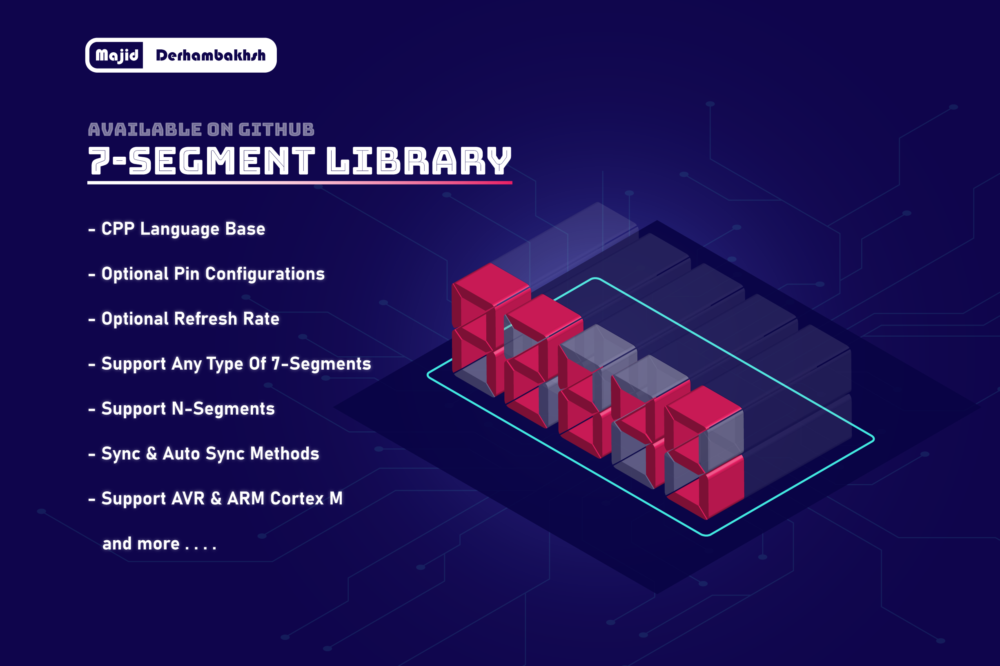

# 7Segment-Library
"High Performance" &amp; "Easy To Use" library for 7-Segment display in AVR - ARM Cortex M

### Version : 0.0.0

- #### Type : Embedded Software.

- #### Support : AVR/ARM STM32 series.

- #### Program Language : C++

- #### Properties :

### Initialization and de-initialization functions:
- Init()
- PinConfig()

### Operation functions:
- Sync()
- SyncLoop()
- DisplayOff()
- DisplayOn()
- Shift()
- Clear()
- Show()
- ShowASync()

### Macros:
- _ENABLE_CUSTOM_PIN

## How to use this driver

### The Menu Manager library can be used as follows:
#### 1.  Add .h and source file in project.      
#### 2.  Create configurations, for example:  
   * Config type:  
      ```c++
      SSegmentCfg_TypeDef
      ```
   * Parameters:  
      * ControlGPIO = Connected GPIO for enable PINs  
      * ControlPinA = Segment 1 enable pin  
      * DataGPIO    = Connected GPIO for data PINs (A ~ F with dot point)  
      * DataPinA    = Data PIN A  
      * Type        = Type of Segments (CommonCathode / CommonAnode)  
          
          
   * Example:
      ```c++
      SSegmentCfg_TypeDef disp_cfg;
      
      disp_cfg.ControlGPIO = GPIOA;
      disp_cfg.ControlPinA = 1;
      disp_cfg.DataGPIO    = GPIOA;
      disp_cfg.DataPinA    = 5;
      disp_cfg.Type        = CommonAnode;
      ```
      
#### 3.  Create SSegment object and initialize it, for example:  
- #### For global access:  
   * Object Initializer:
      ```c++
      SSegment(uint8_t _nmb_of_segments, uint8_t _refresh_rate, uint8_t _buffer_length);
      ``` 
   * Parameters:  
      * _nmb_of_segments : Number of connected segments (uint8 value - Max 255)  
      * _refresh_rate : Display refresh rate (uint8 value - Max 255)  
      * _buffer_length : Buffer length of data (uint8 value - Max 255)  
          
          
   * Example:
      ```c++  
      SSegment MainDisplay(4, 50, 8);
   
      MainDisplay.Init(disp_cfg);
   
      // disp_cfg Is from the previous step
      ``` 
- #### For local access:  
   * Object Initializer:
      ```c++
      SSegment(SSegmentCfg_TypeDef _cfg, uint8_t _nmb_of_segments, uint8_t _refresh_rate, uint8_t _buffer_length);
      ``` 
   * Parameters:  
      * _cfg : Configuration of segments (SSegmentCfg_TypeDef type)  
      * _nmb_of_segments : Number of connected segments (uint8 value - Max 255)  
      * _refresh_rate : Display refresh rate (uint8 value - Max 255)  
      * _buffer_length : Buffer length of data (uint8 value - Max 255)  
          
          
   * Example:
      ```c++  
      SSegment MainDisplay(disp_cfg, 4, 50, 8);
   
      MainDisplay.Init(disp_cfg);
   
      // disp_cfg Is from the previous step
      ``` 
     
#### 4.  Using Sync methods for refresh display, for example:  
- #### For ISR(Interrupt) mode refresh:  
   ```c++
   void Timer_Interrupt(void)
   {
      MainDisplay.Sync();
   }
   
   ``` 
- #### For Loop mode refresh:  
   ```c++
   int main()
   {
      //Your codes
      
      while(1)
      {
         MainDisplay.SyncLoop();
      }
   }
   
   ``` 
#### 5.  Using operation methods, for example: 
   ```c++
   int main()
   {
      //Your codes
      
      MainDisplay.Clear();
      MainDisplay.Show("Hello");
      
      while(1)
      {
         
      }
   }
   ```
    
## Tests performed:
- [ ] Run on AVR
- [x] Run on STM32 Fx cores

#### Developer: Majid Derhambakhsh
